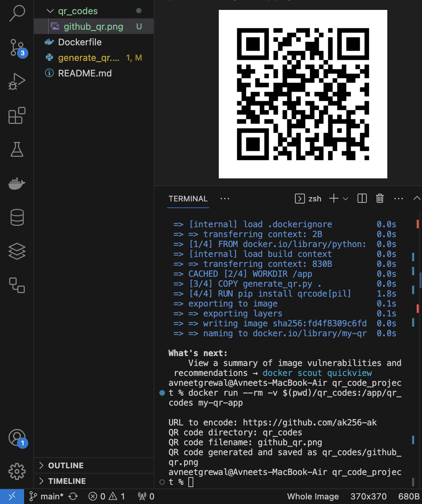

# QR Code Project

# Table of Contents
- [Project Overview]
- [Prerequisites]
- [Screenshots]
- [Requirements]

# Project Overview

The purpose of this project is to demonstrate the use of Docker with Python to create a program that genertes a QR code linking to a specified URL. The generated QR code is saved as a PNG image and can be scanned with a smartphone to navigate to the target URL.

# Prerequisites
- Install (https://www.docker.com/get-started) and make sure it’s running on your computer ( on mac you can see it on top right of menu)

# Clone the Repository
Clone this repository to your local machine:

git clone https://github.com/ak256-ak/qr_code_project.git

cd qr_code_project

docker build -t my-qr-app .

Run the container to generate the QR code image:

docker run --rm -v $(pwd)/qr_codes:/app/qr_codes my-qr-app

# screenshots

# QR Code for My GitHub Homepage

# Log Output of QR Code Generation

# Requirements

Python 3
Docker
Python qrcode library 
